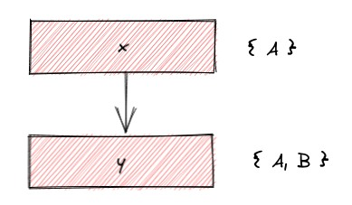
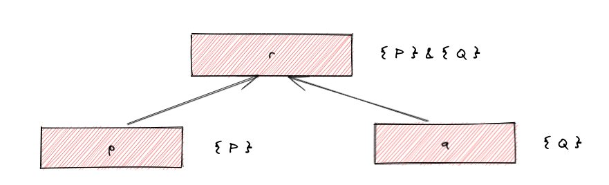
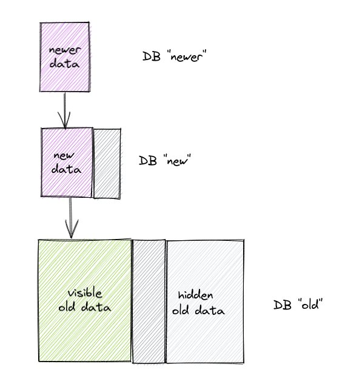
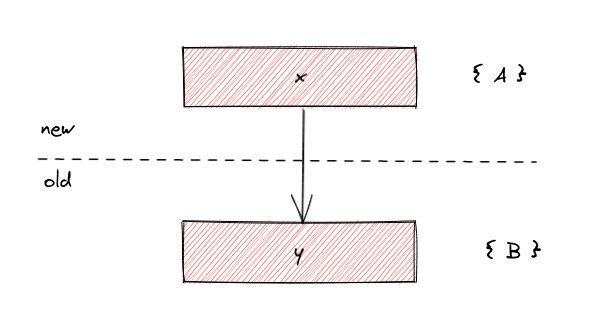

import {SrcFile,SrcFileLink} from '@site/utils';

# Incremental Indexing with Glean

  This post describes how Glean supports *incremental indexing* of
  source code, to maintain an up-to-date index of a large repository
  using minimal resources. This is an overview of the problems and
  some aspects of how we solved them; for the technical details of the
  implementation see [Implementation Notes:
  Incrementality](/docs/implementation/incrementality).

## Background

Indexing a large amount of source code can take a long time. It's not
uncommon for very large indexing jobs to take multple
hours. Furthermore, a monolithic indexing job produces a large DB that
can be slow to ship around, for example to replicate across a fleet of
Glean servers.

Source code changes often, and we would like to keep the index up to
date, but redoing the monolithic indexing job for every change is out
of the question. Instead what we would like to do is to update a
monolithic index with the *changes* between the base revision and the
current revision, which should hopefully be faster than a full
repository indexing job because we only have to look at the things
that have changed. The goal is to be able to index the changes in
*O(changes)* rather than *O(repository)*, or as close to that as we
can get.

## How incrementality works

To produce a modified DB, we hide a portion of the data in the
original DB, and then stack a DB with the new data on top. Like this:


The user asks for the DB "new", and they can then work with the data
in exactly the same way as they would for a single DB. The fact that
the DB is a stack is invisible to a user making queries. Furthermore,
the DB "old" still exists and can be used simultaneously, giving us
access to multiple versions of the DB at the same time. We can even
have many different versions of "new", each replacing a different
portion of "old".

All of the interesting stuff is in how we hide part of the data in the
old DB.  How do we hide part of the data?

When facts are added to a Glean DB, the producer of the facts can
label facts with a *unit*. A unit is just a string; Glean doesn't impose
any particular meaning on units so the indexer can use whatever
convention it likes, but typically a unit might be a filename or
module name. For example, when indexing a file F, the indexer would
label all the facts it produces with the unit F.

To hide some of the data in a DB, we specify which units to exclude
from the base DB, like this:

```
glean create --repo <new> --incremental <old> --exclude A,B,C
```

would create a DB `<new>` that stacks on top of `<old>`, hiding units A, B
and C.

So to index some code incrementally, we would first decide which files
need to be reindexed, create an incremental DB that hides those files
from the base DB and then add the new facts.

To implement hiding correctly, Glean has to remember which facts are
owned by which units. But it's not quite that simple, because facts
can refer to each other, and the DB contents must be valid (which has
a formal definition but informally means "no dangling
references"). For example, if we have facts **x** and **y**, where **x** refers to
**y**:


and we hide unit B, then **y** must still be visible, otherwise the
reference from **x** would be dangling and the DB would not be valid.

So after the indexer has finished producing facts, Glean propagates
all the units through the graph of facts, resulting in a mapping from
facts to **ownership sets**.



It turns out that while there are lots of facts, there are relatively
few distinct ownership sets. Furthermore, facts produced together tend
to have the same ownership set, and we can use this to store the
mapping from facts to ownership sets efficiently. To summarise:


* Ownership sets are assigned unique IDs and stored in the DB using <a href="https://github.com/facebook/folly/blob/main/folly/experimental/EliasFanoCoding.h">Elias Fano Coding</a>
* The mapping from facts to ownership sets is
  stored as an interval map

As a result, keeping all this information only adds about 7% to the DB
size.

### What about derived facts?

Derived facts must also have ownership sets, because we have to know
which derived facts to hide. When is a derived fact visible? When all
of the facts that it was derived from are visible.

For example, if we have a fact **r** that was derived from **p** and **q**:



The ownership set of **r** is `{ P } & { Q }`, indicating that it should be
visible if both P and Q are visible. Note that facts might be derived
from other derived facts, so these ownership expressions can get
arbitrarily large. Normalising them to disjunctive normal form would
be possible, but we haven't found that to be necessary so far.

### Performance

There are three aspects to performance:

* **Indexing performance**. We measured the impact of computing
 ownership at indexing time to be 2-3% for Python, for Hack it was in
 the noise, and we don't
 expect other languages to be significantly different.
* **Query performance**. Initially query performance for an
 incremental stack was much slower because we have to calculate the visibility of every fact discovered during a query. However, with some [caching optimisations](/docs/implementation/incrementality#caching-fact-ownership) we were able to get the overhead to less than 10% for "typical" queries, of the kind that Glass does. Queries that do a lot of searching may be impacted by around 3x, but these are not typically found in production use cases.
* **Incremental derivation performance**. We would like derivation in the incremental DB to take time proportional to the number of facts in the increment. We implemented incremental derivation for some kinds of query; optimising queries to achieve this in general is a hard problem that we'll return to probably next year.

### Stacked incremental DBs

So far we have only been considering how to stack a single increment
on top of a base DB. What if we want to create deeper stacks?



The DB "newer" stacks on top of "new", and hides some more units. So
there are now portions of both "new" and "old" that need to be hidden
(the darker grey boxes), in addition to the original portion of "old"
that we hid (light grey box).

As before, we might have multiple versions of "newer" stacked on top
of the same "new", and in general these DB stacks form a tree. All the
intermediate nodes of the tree are usable simultaneously: no data is
being modified, only shared and viewed differently depending on which
node we choose as the top of our stack.

One interesting aspect that arises when we consider how to track
ownership of facts in this model is fact dependencies across the
boundaries between DBs.  For instance, suppose we have



If we hide B, then considering the ownership data for "old" alone
would tell us that y is invisible. But we must make it visible,
because x depends on it. So when computing the ownership data for
"new", we have to transitively propagate ownership to facts in the
base DB(s), store that in "new", and consult it when deciding which
facts in "old" are visible.

### Derived facts in stacked incremental DBs

A fact might be derived from multiple facts in different DBs in the
stack, and we have to represent its ownership correctly. Therefore

* There must be a single namespace of ownership sets for the whole DB stack. That is, stacked DBs add more sets. (or else we copy ownership sets from the base DB, which doesn't seem attractive).
* Since a fact may be owned multiple different ways (see previous section) we have to take this into account when computing the ownership expression for a derived fact.

This is the most complex diagram in the post (phew!):


Here the dashed arrow means "derived from" and the solid arrow means
"refers to".

The fact **d** should be visible if both **x** and **y** are visible. The
ownership of **x** is `{A}` and **y** is `{B,C}` (because it is referred to from **z**
which has owner B), so the final owner of **d** is `{A} && {B,C}`.

Tracking all this shouldn't be too expensive, but it's tricky to get
right!
